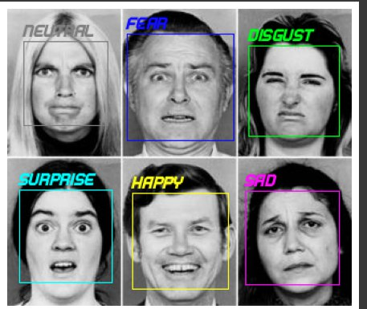

<h1 style="color:blue">Sentiment Analysis using Img</h1>

<h4>This is about how to analyze the faces sentiment using  fer2013 model<h4>


```bash
pip install -r requirements.txt
```


<h2>Libraries</h2>

```python
import requests
import cv2
from PIL import Image, ImageDraw, ImageFont
from io import BytesIO
import numpy as np
import matplotlib.pyplot as plt
from torchvision import transforms
import onnx
import tensorflow as tf
import keras
import tf2onnx
import onnxruntime
```

<h2>Sources</h2>

<span>Model Source</span>

*[fer2013.htd5](https://drive.google.com/file/d/16miisjAYDfTd65C-eghmDcS4rCOM617d/view?usp=sharing)


<span>Font Source</span>

*[BEATTECH.otf](https://drive.google.com/file/d/1wCGE9Eb7QBWWOhnXTgAe4n47TblkqeXQ/view?usp=sharing)

<h3>Output Instance</h3>



